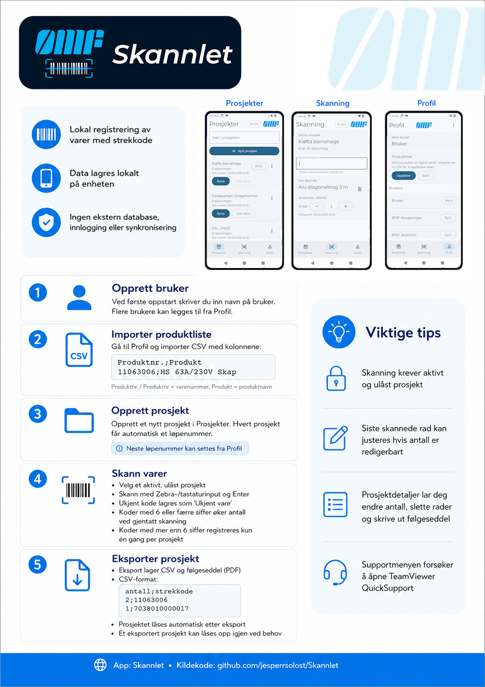

<p align="center">
  
</p>


# Skannlet

Skannlet er en Android-applikasjon for lokal registrering av varer med strekkode. Appen er laget for prosjektbasert skanning der hver skanning knyttes til et prosjekt, og prosjektdata kan eksporteres som CSV og PDF/følgeseddel.

Applikasjonen lagrer data lokalt på enheten. Den har ingen ekstern database, innlogging mot server eller nettverksavhengig synkronisering.

## Hovedfunksjoner

- Opprette og velge aktive brukere.
- Opprette prosjekter/samlinger for skanning.
- Automatisk løpenummer per prosjekt, fra `1` og oppover.
- Manuell justering av neste løpenummer fra profilen.
- Skanning via Zebra-/tastaturinput som avsluttes med Enter.
- Automatisk oppslag av produktnavn fra importert produktliste.
- Antallshåndtering for korte varenummer.
- Unik registrering for strekkoder med mer enn seks siffer.
- Søk i prosjektlisten.
- Redigering og sletting av skannede rader før prosjektet låses.
- Eksport av prosjekt til CSV.
- Utskrift/deling av følgeseddel som PDF.
- Automatisk låsing av prosjekt etter eksport.
- Lokal import og sletting av produktliste.
- Supportmeny som forsøker å åpne TeamViewer QuickSupport.
- Om-side med versjon, lisens og lenke til kildekode.

## Brukerflyt

### Første oppstart

Ved første oppstart ber appen om navn på bruker. Brukeren lagres lokalt og settes som aktiv bruker.

Flere brukere kan legges til fra `Profil` via menyen øverst til høyre. Aktiv bruker kan byttes fra prosjektlisten eller skanneskjermen.

### Produktliste

Produktlisten importeres fra `Profil`.

CSV-filen må inneholde disse kolonnene:

```csv
Produktnr.;Produkt
11063006;HS 63A/230V Skap
```

Importen støtter:

- semikolon, komma eller tab som skilletegn
- UTF-8 med eller uten BOM
- hermetegn og escaped hermetegn i CSV-felt
- ekstra kolonner

Kolonnene `Produktnr.` eller `Produktnr` brukes som strekkode/varenummer. Kolonnen `Produkt` brukes som produktnavn.

Når en ny produktliste importeres, erstatter den tidligere produktlisten. Eksisterende skannede rader får oppdatert produktnavn dersom varenummeret finnes i den nye listen. Rader uten treff settes til `Ukjent vare`.

### Prosjekter

Prosjekter opprettes fra fanen `Prosjekter`. Hvert prosjekt får et stabilt løpenummer:

- første prosjekt får nummer `1`
- neste prosjekt får nummer `2`
- nummeret økes med én for hvert nye prosjekt
- eksisterende prosjekter beholder nummeret sitt

Løpenummeret vises i prosjektlisten og brukes på følgeseddelen som:

```text
Følgeseddel #<løpenummer> | <prosjektnavn>
```

Neste løpenummer kan settes manuelt fra `Profil` -> meny -> `Sett løpenummer`. Appen tillater ikke at neste nummer settes lavere enn allerede brukte prosjektnummer.

### Aktivt prosjekt

Skanning krever et aktivt, ulåst prosjekt. Prosjekter kan settes aktive fra prosjektlisten eller fra detaljsiden.

Låste prosjekter kan ikke brukes til ny skanning eller redigering før de låses opp igjen.

### Skanning

Skanneskjermen har et inputfelt som holder fokus når skanning er aktiv. Feltet er tilpasset scannerinput som avsluttes med Enter.

Ved skanning:

- tom input ignoreres
- produktnavn hentes fra importert produktliste
- ukjente varenummer lagres som `Ukjent vare`
- korte koder, med seks eller færre siffer, kan skannes flere ganger og øker antallet
- koder med mer enn seks siffer behandles som unike og kan bare registreres én gang per prosjekt

Siste skannede rad vises på skanneskjermen. Antall kan justeres for rader der antall ikke er låst.

### Prosjektdetaljer

Detaljsiden viser alle rader i valgt prosjekt. Her kan man:

- sette prosjektet aktivt
- starte skanning for prosjektet
- endre prosjektnavn
- endre antall på redigerbare rader
- slette rader
- slette prosjektet lokalt
- skrive ut følgeseddel
- eksportere prosjektet
- låse opp et eksportert prosjekt

### Eksport og følgeseddel

Eksport oppretter en CSV-fil og forsøker også å legge ved PDF/følgeseddel når delingsdialogen åpnes.

CSV-format:

```csv
antall;strekkode
2;11063006
1;7038010000017
```

PDF/følgeseddel inneholder:

- tittel med løpenummer og prosjektnavn
- ØMF-logo
- antall skanninger
- sist endret-tidspunkt
- aktiv bruker som utskriftsbruker
- tabell med antall, strekkode, produktnavn og tidspunkt

Etter eksport låses prosjektet automatisk. Dersom prosjektet var aktivt, velger appen neste ulåste prosjekt som aktivt der det finnes.

Eksportfiler opprettes midlertidig i appens cacheområde under `exports/` og deles via Android `FileProvider`.

## Skjermer

### Prosjekter

Startskjerm og oversikt over prosjekter. Viser prosjektnavn, løpenummer, antall skanninger, aktivstatus og låsestatus.

Funksjoner:

- opprett nytt prosjekt
- søk etter prosjekt
- åpne prosjekt
- sett prosjekt aktivt
- lås opp prosjekt
- slett prosjekt
- bytt aktiv bruker

### Skanning

Arbeidsflate for fortløpende registrering med scanner.

Funksjoner:

- viser aktivt prosjekt
- tar imot scannerinput
- viser siste registrerte vare
- justerer antall der antall er redigerbart
- sletter siste rad ved behov
- sender brukeren til prosjektvalg hvis ingen aktivt prosjekt finnes

### Profil

Administrasjon av brukere, produktliste, løpenummer og appinformasjon.

Funksjoner:

- legg til bruker
- slett aktiv bruker
- bytt aktiv bruker
- importer eller slett produktliste
- sett neste løpenummer
- åpne TeamViewer QuickSupport
- åpne om-side

### Om applikasjonen

Viser appnavn, versjon, lisensinformasjon og lenke til kildekode:

```text
https://github.com/jesperrsolost/Skannlet
```

## Lokal datalagring

Appen bruker JSON-filer i Androids interne appområde:

| Fil | Innhold |
| --- | --- |
| `users.json` | Lokale brukere |
| `collections.json` | Prosjekter/samlinger |
| `scan_rows.json` | Skannede rader |
| `products.json` | Importert produktliste |
| `app_state.json` | Aktiv bruker, aktivt prosjekt og neste løpenummer |

Lagring skjer via `LocalJsonStorage`. Skriving gjøres via midlertidig fil før filen erstattes, slik at risikoen for delvis skrevne JSON-filer reduseres.

Ved oppstart leses alle lokale filer. Dersom en fil ikke kan leses, bruker appen standardverdi for den filen og viser en feilmelding til brukeren.

Hvis `products.json` ikke finnes, opprettes en liten demoproduktliste.

## Arkitektur

Prosjektet er en enkel Android-app med én Gradle-modul: `:app`.

Viktigste pakker:

```text
com.jrs.skannlet
├── app              App-root, navigasjon, ViewModel og delt UI-state
├── data
│   ├── export       CSV-eksport
│   ├── importer     CSV-import av produktliste
│   ├── model        Serializable datamodeller
│   ├── repository   Appens datakontrakt og forretningsregler
│   └── storage      Lokal JSON-lagring
├── scanner          Scannerinput for Compose
├── ui
│   ├── collections  Prosjektliste og prosjektdetaljer
│   ├── components   Delte Compose-komponenter
│   ├── profile      Profil, produktliste, support og om-side
│   ├── scan         Skanneskjerm
│   └── theme        Material 3-tema
└── util             Datoformatering
```

### Dataflyt

Appen bruker en enkel, ensrettet dataflyt:

1. Compose-skjerm sender brukerhandling til `AppViewModel`.
2. `AppViewModel` kaller `ScannerRepositoryContract`.
3. `ScannerRepository` utfører validering, forretningsregler og lagring.
4. `LocalJsonStorage` leser/skriver lokale JSON-filer.
5. `AppViewModel` bygger ny `AppUiState`.
6. UI oppdateres fra `StateFlow` med lifecycle-aware innsamling.

Engangshendelser, som deling av eksport, sendes via `AppEffect`.

### Viktige regler i repository

- Tomme brukernavn og prosjektnavn avvises.
- Aktiv bruker/prosjekt valideres ved lasting.
- Låste prosjekter kan ikke skannes eller redigeres.
- Eksport krever aktiv bruker.
- Prosjektet låses etter eksport.
- Løpenummer repareres ved lasting dersom gamle prosjekter mangler nummer eller har konflikt.
- Neste løpenummer settes alltid til minst høyeste brukte løpenummer + 1.

## Teknologistack

- Kotlin
- Jetpack Compose
- Material 3
- Navigation Compose
- Lifecycle ViewModel og `collectAsStateWithLifecycle`
- Kotlinx Serialization JSON
- Android `PdfDocument`
- Android `FileProvider`
- JUnit for enhetstester

Gradle-/Android-oppsett:

- Android Gradle Plugin `9.2.1`
- Kotlin `2.2.10`
- Gradle Wrapper `9.4.1`
- `compileSdk` 36.1
- `targetSdk` 36
- `minSdk` 28
- Java toolchain 11

## Bygge og kjøre lokalt

### Forutsetninger

- Android Studio med Android SDK installert
- JDK 11 eller Android Studios innebygde JBR
- `local.properties` med `sdk.dir` for lokal Android SDK

På Windows kan det være nødvendig å sette `JAVA_HOME` før Gradle-kommandoer:

```powershell
$env:JAVA_HOME='C:\Program Files\Android\Android Studio\jbr'
```

### Vanlige kommandoer

Windows:

```powershell
.\gradlew.bat :app:assembleDebug
.\gradlew.bat :app:testDebugUnitTest
.\gradlew.bat :app:lintDebug
```

macOS/Linux:

```bash
./gradlew :app:assembleDebug
./gradlew :app:testDebugUnitTest
./gradlew :app:lintDebug
```

Debug-APK bygges til:

```text
app/build/outputs/apk/debug/app-debug.apk
```

## Tester

Prosjektet har enhetstester for produktimport:

- parsing av CSV med `Produktnr.` og `Produkt`
- feil ved manglende påkrevde kolonner

Kjør:

```powershell
.\gradlew.bat :app:testDebugUnitTest
```

## Manuell testliste

Kjør gjennom dette etter endringer i appen:

1. Start appen med tom lokal data og opprett første bruker.
2. Opprett et nytt prosjekt og kontroller at løpenummer starter på `1`.
3. Opprett flere prosjekter og kontroller at løpenummer øker med én.
4. Gå til `Profil` -> `Sett løpenummer`, sett neste nummer, og opprett nytt prosjekt.
5. Importer en produktliste med kolonnene `Produktnr.` og `Produkt`.
6. Skann et varenummer som finnes i produktlisten og kontroller produktnavn.
7. Skann et ukjent varenummer og kontroller at raden viser `Ukjent vare`.
8. Skann samme korte kode flere ganger og kontroller at antall øker.
9. Skann samme lange strekkode flere ganger og kontroller at du får melding om duplikat.
10. Endre antall på en redigerbar rad.
11. Slett en rad.
12. Eksporter prosjektet og kontroller at CSV og PDF kan deles.
13. Kontroller at PDF-tittelen viser `Følgeseddel #<løpenummer> | <prosjektnavn>`.
14. Kontroller at prosjektet låses etter eksport.
15. Lås opp prosjektet og kontroller at redigering/skanning fungerer igjen.
16. Åpne `Om applikasjonen` og kontroller at `kildekode` åpner GitHub-lenken.

## Ressurser og ikoner

Launcherikon ligger i `res/mipmap-*` og adaptive icon-oppsett i `res/mipmap-anydpi`.

ØMF-logoen som brukes inne i appen og på følgeseddelen ligger i:

```text
app/src/main/res/drawable/omflogo.png
```

Denne logoen er separat fra launcherikonet.

## Lisens

Appen viser lisens som `Apache 2.0` på om-siden.

## Kildekode

```text
https://github.com/jesperrsolost/Skannlet
```
